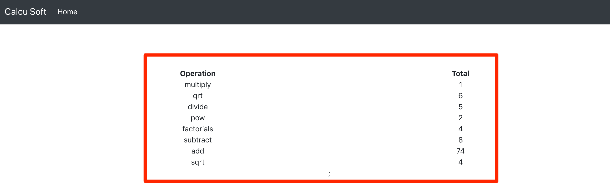
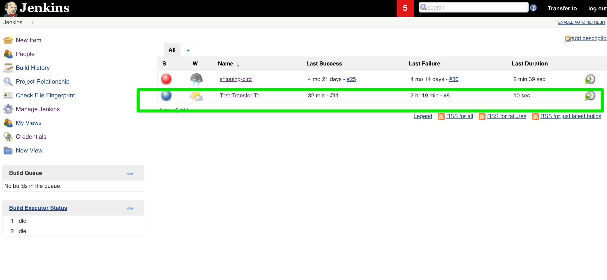
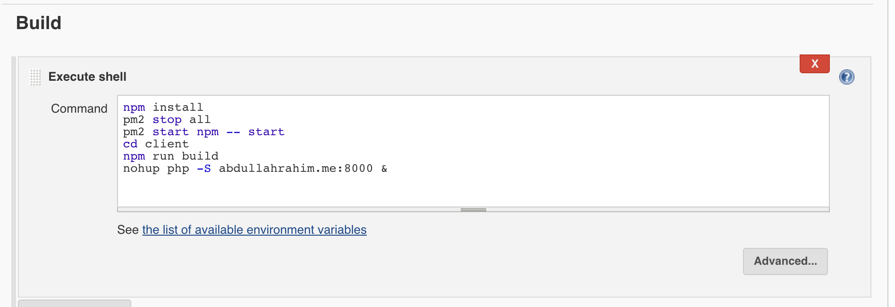

***Test for TransferTO***

**Documentation:**

 - Documentation can be found at `http://abdullahrahim.me:3000/swagger`
 - You can test the API.
 
 
**Dashboard:** 

- Dashboard for stats can be accessed at `http://abdullahrahim.me:8000/ `

**CI/CD:**

- I have set up Jenkins at `http://abdullahrahim.me:8080/jenkins/`
Username: transferTo
Password: test

- Deployment script can be found in configure section in the project.

**Docker:**
I tried out but there are some issues which I will fix later. 